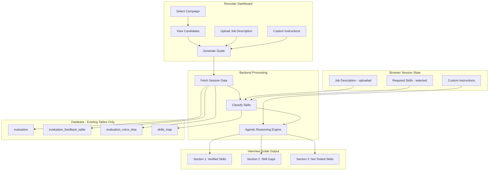
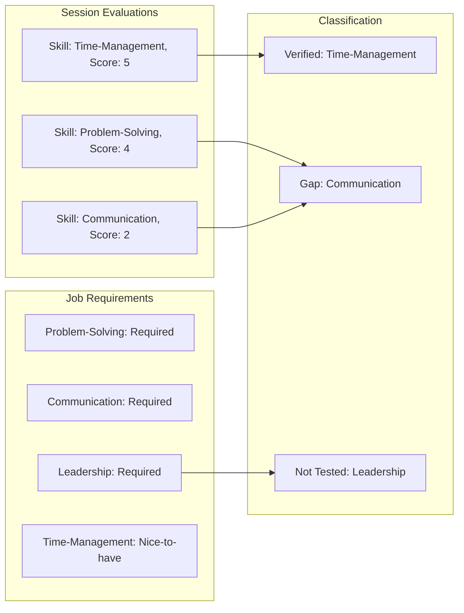

# Agentic Pre-Interview Guide - Complete Implementation Plan

## Database Structure Analysis (From Actual Data)

### Tables and Their Purpose

| Table | Purpose | Key Fields |

|-------|---------|------------|

| `evaluation` | Chat/Email simulation results | `session_id`, `campaign_id`, `skill`, `result` (score + reason), `transcript` |

| `evaluation_feedback_table` | Aggregated session feedback | `session_id`, `evaluation_results` (all skills), `feedback` (Key_Strengths) |

| `evaluation_voice_elsa` | Voice simulation results | `session_id`, `elsa_score` (CEFR ratings), `result` (rationale per attribute) |

| `skills_map` | Master skill definitions | `skill_id`, `skill_name`, `skill_prompt` |

### Data Structure Details

**evaluation.result format:**

```json
{"score": 4, "reason": "The user communicates clearly..."}
```

**evaluation_feedback_table.feedback format:**

```json
{
  "Key_Strengths": [
    {"title": "Written Communication", "strength": "You demonstrate strong..."}
  ]
}
```

**evaluation_voice_elsa.elsa_score format:**

```json
{
  "pronunciation_cefr": 1,
  "fluency_cefr": 5,
  "grammar_cefr": 5,
  "overall_cefr": 3
}
```

---

## System Architecture



---

## Job Description Handling (No Database Storage)

Job Description is **uploaded per generation session**, not stored in database:

```
Recruiter Flow:
1. Select Campaign → See candidates list
2. Paste Job Description (stored in browser state only)
3. Select required skills from skills_map dropdown
4. Add custom instructions (optional)
5. Generate guide → JD applies to all selected candidates
```

**Benefits:**

- No database migration required
- Flexible - can tweak JD per session
- Same JD context for entire candidate batch
- Recruiter controls what's used each time

**Frontend State:**

```typescript
interface GenerationContext {
  campaignId: string;
  jobDescription: string;           // Pasted by recruiter
  requiredSkills: SkillRequirement[]; // Selected from skills_map
  customInstructions: string;       // Optional notes
}
```

---

## Agentic Reasoning Flow

For each candidate, the agent performs these reasoning steps:

### Step 1: Data Collection

```
Collect all evaluations for session_id
- From evaluation table (chat/email skills)
- From evaluation_voice_elsa (if voice simulation)
- From evaluation_feedback_table (aggregated feedback)
```

### Step 2: Skill Classification



Classification Logic:

- **Verified**: Score >= 4 AND skill in job requirements
- **Gap**: Score < 4 AND skill in job requirements (priority based on score)
- **Not Tested**: In job requirements BUT not in evaluations

### Step 3: Chain-of-Thought Question Generation

For each skill gap, generate reasoning chain:

```json
{
  "skill": "Communication",
  "classification": "gap",
  "reasoning": {
    "data_observation": "Score: 2/5 in EMAIL_CONVERSATION simulation",
    "evidence_from_transcript": "User responses were brief and lacked context for the recipient",
    "evidence_from_feedback": "Feedback noted: 'Messages could include more context'",
    "gap_significance": "Critical for role - daily client communication required",
    "interview_strategy": "Need behavioral examples of written communication in professional setting",
    "question_rationale": "STAR format question to assess real-world communication adaptation"
  },
  "question": {
    "text": "Tell me about a time you had to explain a complex issue to a non-technical stakeholder via email. How did you structure your message?",
    "what_to_listen_for": ["Clear structure", "Audience awareness", "Follow-up handling"],
    "red_flags": ["Blaming recipient for misunderstanding", "No adaptation to audience"],
    "follow_ups": ["How did they respond?", "What would you change?"]
  }
}
```

---

## UI Design

### Page 1: Campaign Dashboard (Home)

```
+----------------------------------------------------------+
| Skillfully - Interview Guide Generator                    |
+----------------------------------------------------------+
| Select Campaign:  [Dropdown: Athena EA 2025 ▼]           |
+----------------------------------------------------------+
| Candidates (12 total)                    [Upload JD]     |
+----------------------------------------------------------+
| ☐ | Name           | Email         | Sessions | Status   |
+----------------------------------------------------------+
| ☐ | Sarah Chen     | sarah@...     | 2        | Ready    |
| ☐ | Marcus Johnson | marcus@...    | 1        | Ready    |
| ☐ | Emily Rodriguez| emily@...     | 3        | Ready    |
+----------------------------------------------------------+
| [Generate Guide for Selected] or click row for individual|
+----------------------------------------------------------+
```

### Page 2: Generation Context (After Selecting Candidates)

```
+----------------------------------------------------------+
| Generate Guide for: 3 selected candidates                 |
| Campaign: Athena EA 2025                                  |
+----------------------------------------------------------+
| Job Description (paste here - applies to all selected):   |
| [                                                        ]|
| [  Paste the job description for Executive Assistant     ]|
| [  role here. This will be used to identify which        ]|
| [  skills are required vs nice-to-have.                  ]|
| [                                                        ]|
+----------------------------------------------------------+
| Required Skills (select from list):                       |
| [x] Communication          Priority: [High ▼]            |
| [x] Problem-Solving        Priority: [High ▼]            |
| [x] Time-Management        Priority: [Medium ▼]          |
| [ ] Leadership             Priority: [Low ▼]             |
| [+ Add skill from skills_map]                             |
+----------------------------------------------------------+
| Custom Instructions (optional):                           |
| [                                                        ]|
| [  Add any specific notes for this batch of candidates   ]|
| [                                                        ]|
+----------------------------------------------------------+
| Questions per candidate: [8 ▼]                            |
|                                                          |
| [Generate Agentic Interview Guides]                       |
+----------------------------------------------------------+
```

Note: Job description and skills are stored in browser state only, not database.

### Page 3: Individual Candidate Guide Generation

```
+----------------------------------------------------------+
| Generate Guide for: Sarah Chen                            |
| Campaign: Athena EA 2025 | Sessions: 2                    |
+----------------------------------------------------------+
| Simulation Results Summary:                               |
| - EMAIL_CONVERSATION: 4 skills evaluated                  |
| - CHAT_CONVERSATION: 3 skills evaluated                   |
+----------------------------------------------------------+
| Custom Instructions (optional):                           |
| [Focus on leadership potential - she's being considered  ]|
| [for team lead role in 6 months                         ] |
+----------------------------------------------------------+
| Questions to Generate: [8 ▼]                              |
|                                                          |
| [Generate Agentic Interview Guide]                        |
+----------------------------------------------------------+
```

### Page 4: Interview Guide Output (with Reasoning)

```
+----------------------------------------------------------+
| INTERVIEW GUIDE: Sarah Chen                               |
| Role: Executive Assistant | Generated: Dec 10, 2024       |
+----------------------------------------------------------+
| SECTION 1: VERIFIED SKILLS (Brief Acknowledgment)         |
| These skills scored 4+ in simulation - minimal probing    |
+----------------------------------------------------------+
| ✓ Time-Management (Score: 5/5)                           |
| ✓ Attention-to-Detail (Score: 4/5)                       |
|                                                          |
| Suggested: "I see you handled the time-sensitive tasks   |
| well in the simulation. Can you briefly share how you    |
| typically prioritize competing deadlines?"                |
+----------------------------------------------------------+
| SECTION 2: SKILL GAPS (Deep Probing Required)             |
| These skills need interview assessment                    |
+----------------------------------------------------------+
| ⚠ Communication (Score: 2/5) - HIGH PRIORITY              |
|                                                          |
| [Show AI Reasoning ▼]                                     |
| ┌─────────────────────────────────────────────────────┐  |
| │ Data Observation: Scored 2/5 in EMAIL_CONVERSATION  │  |
| │ Evidence: "User responses lacked context for..."    │  |
| │ Feedback Note: "Messages could be more detailed"    │  |
| │ Gap Significance: Critical - role requires daily    │  |
| │   client communication                              │  |
| │ Strategy: Behavioral question to assess real-world  │  |
| │   written communication skills                      │  |
| └─────────────────────────────────────────────────────┘  |
|                                                          |
| Question 1:                                               |
| "Tell me about a time you had to explain a complex       |
| issue to a non-technical stakeholder via email."          |
|                                                          |
| ✓ Listen for: Clear structure, Audience awareness        |
| ⚠ Red flags: Blaming recipient, No adaptation            |
| → Follow-ups: "How did they respond?" "What would..."    |
+----------------------------------------------------------+
| SECTION 3: SKILLS NOT TESTED (Assessment Needed)          |
| Required by job but not in simulation                     |
+----------------------------------------------------------+
| ○ Leadership (Required: Medium Priority)                  |
|                                                          |
| [Show AI Reasoning ▼]                                     |
| ┌─────────────────────────────────────────────────────┐  |
| │ Note: This skill was not evaluated in simulation    │  |
| │ Job Requirement: Medium priority for EA role        │  |
| │ Custom Instruction: "Consider for team lead in 6mo" │  |
| │ Strategy: Standard behavioral assessment            │  |
| └─────────────────────────────────────────────────────┘  |
|                                                          |
| Question 4:                                               |
| "Describe a situation where you had to lead a project    |
| or initiative without having formal authority."           |
+----------------------------------------------------------+
| [Print Guide] [Export PDF] [Copy All Questions]          |
+----------------------------------------------------------+
```

---

## Implementation Tasks

### Backend Changes

1. **New routes**: [backend/app/routes/evaluations.py](backend/app/routes/evaluations.py)

   - `GET /campaigns` - List unique campaigns with candidate counts
   - `GET /campaigns/{id}/candidates` - List candidates with evaluation summary
   - `GET /skills` - Get all skills from skills_map (for dropdown)
   - `POST /generate-agentic-guide` - Main endpoint:
     - Accepts: session_ids[], job_description (text), required_skills[], custom_instructions
     - Returns: Structured guide with reasoning chains

2. **New LLM method**: [backend/app/llm_service.py](backend/app/llm_service.py)

   - `generate_agentic_guide()` - Chain-of-thought reasoning prompt
   - Job context passed in request, NOT from database

### Frontend Changes

1. **Campaign selector page**: Landing page with campaign dropdown and candidate count
2. **Candidates list**: Table with checkboxes for bulk selection, evaluation summary per candidate
3. **Generation form** (appears after selecting candidates):

   - Job description text area (paste JD, stored in React state)
   - Skills multi-select dropdown (fetched from skills_map)
   - Custom instructions text area (optional)
   - "Generate for Selected" button

4. **Reasoning display**: Expandable sections showing AI chain-of-thought
5. **Structured output**: 3-section guide (Verified / Gaps / Not Tested)

---

## Key Technical Decisions

1. **Session Type Separation**: Query `evaluation` OR `evaluation_voice_elsa` based on `scenario_type`, never mix
2. **Score Threshold**: 4/5 = Verified, <4 = Gap (configurable)
3. **Reasoning Storage**: Generated reasoning returned in API response, not stored in DB
4. **Job Description**: Uploaded per session (browser state), NOT stored in database - applies to all candidates in batch
5. **Custom Instructions**: Passed to LLM as additional context, can be global (all candidates) or per-candidate
6. **No New DB Tables**: Uses only existing tables - no migrations required

---

## Success Metrics

| Metric | Target |

|--------|--------|

| Reasoning accuracy | Evidence cites actual transcript/feedback |

| Question relevance | Questions target identified gaps |

| Coverage | All gaps + untested skills have questions |

| Recruiter trust | Reasoning is clear and verifiable |